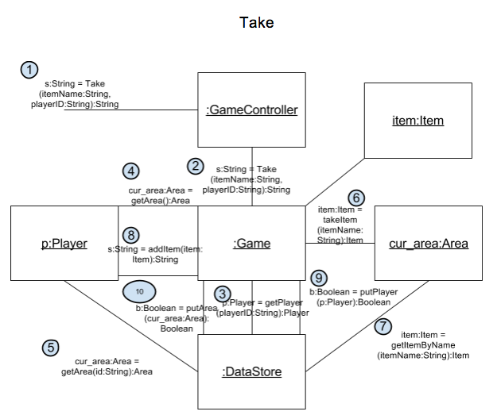
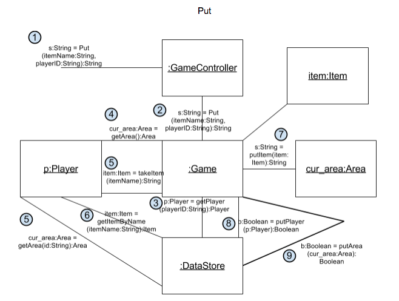
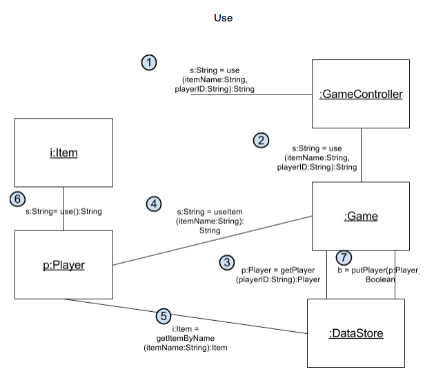
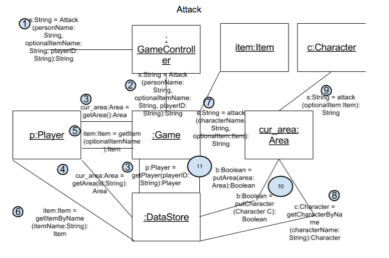
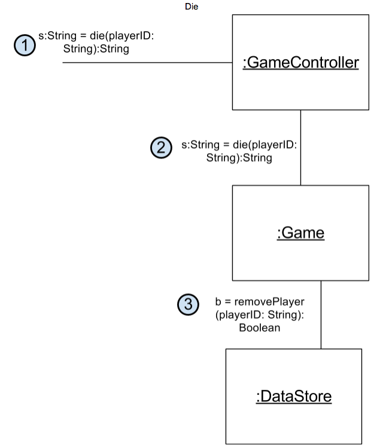

Interation Diagrams
===================

All of the iteration diagrams that we've completed according to Larman's Unified
Process.

## List of Diagrams

### Take

### Put

### Use

### Attack

### Die

